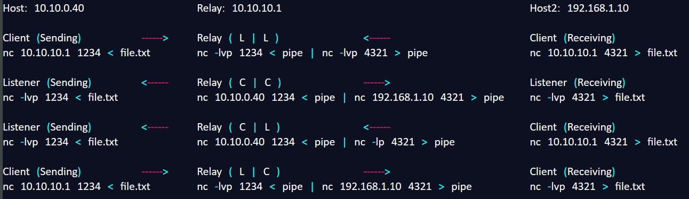

# Netcat Relays

## <mark style="color:red;">Un-named Pipe Pipes</mark>

Un-named pipes in netcat relays are like secret tunnels for one-way communication between processes.

They help transfer data between netcat instances on different hosts or ports without needing specific file names or setups. They make sending and receiving data easy and direct.

Two-way communication between processes can be achieved by using two pipes in opposite "directions".

The STDOUT (1) of the command on the left is sent as STDIN (0) to the command on the right.

Example:

On the local machine, send data using netcat to the remote machine:

```bash
echo "Hello, Remote Machine!" | nc <remote_ip> <remote_port>
```

On the remote machine, receive the data using netcat:

```bash
nc -l -p <remote_port> > received_data.txt
```

### <mark style="color:purple;">Un-named Pipe Example (Flow chart)</mark>

<figure><figcaption></figcaption></figure>

You can use 1 or more relays to transfer your connection.

NC relays typically can only send data in one direction and that is from left to right.

To ssend data back (right to left) you need to use named pipes.

## <mark style="color:red;">Named Pipes</mark>

AKA "FIFOs", Named Pipes are treated like files. They let processes read and write to each other.

Two-way communication so processes can share information.

Example:

You can create a named pipe using <mark style="color:yellow;">`mknod`</mark> or <mark style="color:yellow;">`mkfifo`</mark>.

<mark style="color:yellow;">`mknod mypipe p`</mark>

<mark style="color:yellow;">`Mknod`</mark> = make node

<mark style="color:yellow;">`Mypipe`</mark> = the name of the pipe

<mark style="color:yellow;">`p`</mark> = the file descriptor. p is for Pipe.

<mark style="color:yellow;">`b`</mark> = Block-oriented device file

<mark style="color:yellow;">`c`</mark> = Character-oriented device file

OR

<mark style="color:yellow;">`mkfifo mypipe`</mark>

On the relay machine (This would be the machine in the middle of the sender and receiver)

```bash
mkfifo mypipe
nc 10.1.0.2 9002 0< mypipe | nc 10.2.0.2 9001 1> mypipe
```

On Listener2 (sends info):

```bash
nc -l -p 9002 < infile.txt
```

On Listener1 (receives info):

```bash
nc -l -p 9001 > outfile.txt
```

Writes the output to listener1 and listener2 through the named pipe
